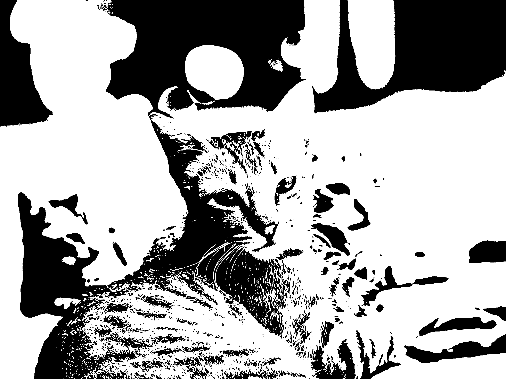
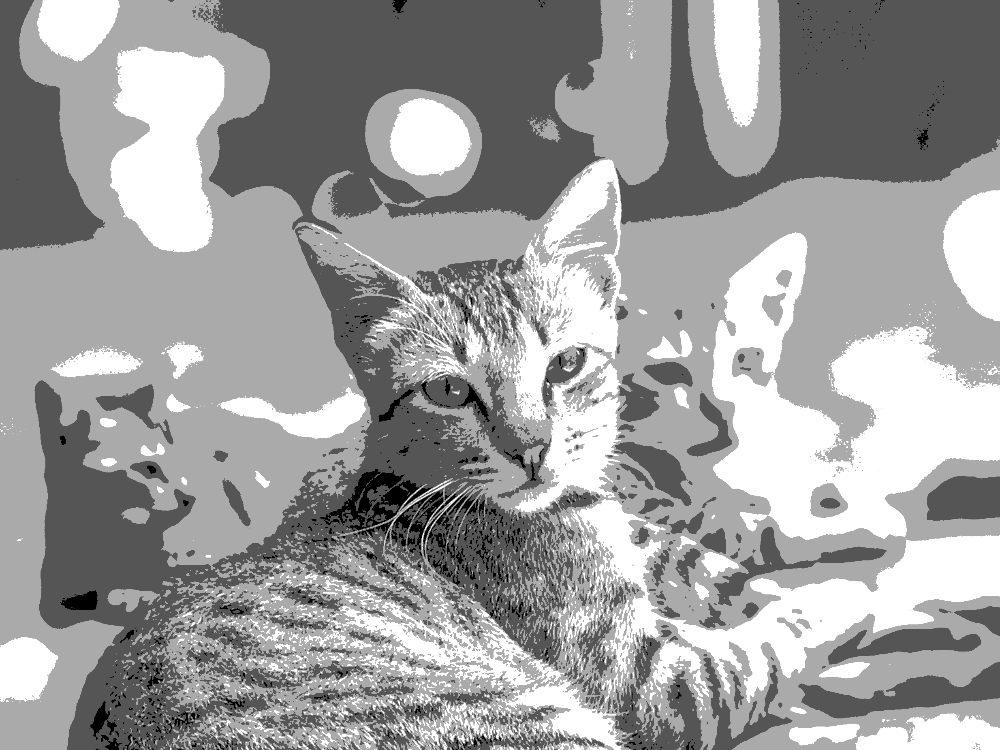
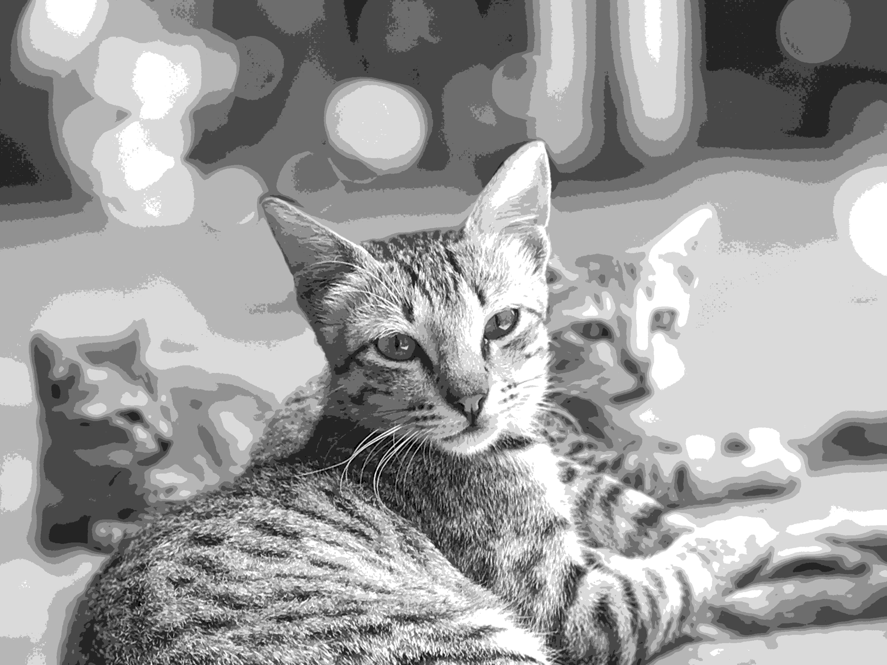
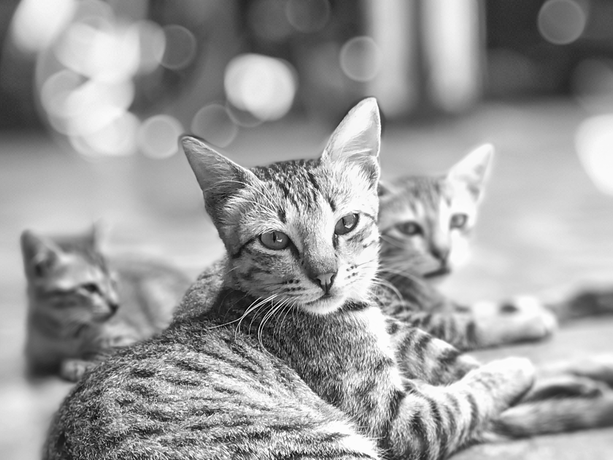

# Image Processing Assignment

This project demonstrates basic image processing operations using Python and OpenCV. The operations are implemented in a Jupyter notebook and include:

## Features

1. **Reduce Number of Intensity Levels**

   - Reduces the number of intensity levels in a grayscale image from 256 to a user-specified value (must be a power of 2).
   - **Example Output:**
     - 
     - 
     - 
     - 
     - 
     - 
     - 
     - 

2. **Spatial Averaging (Mean Filtering)**

   - Applies a mean filter with kernel sizes 3x3, 10x10, and 20x20 to the image.
   - **Example Output:**
     - _Output images for mean filtering are not saved. Please run the notebook and save the outputs if you want to display them here._

3. **Image Rotation**

   - Rotates the image by 45 and 90 degrees.
   - **Example Output:**
     - _Output images for rotation are not saved. Please run the notebook and save the outputs if you want to display them here._

4. **Block-wise Averaging (Spatial Resolution Reduction)**
   - For each non-overlapping block of size 3x3, 5x5, and 7x7, replaces all pixels in the block with their average value.
   - **Example Output:**
     - _Output images for block-wise averaging are not saved. Please run the notebook and save the outputs if you want to display them here._

## How to Use

1. Open the notebook `image_processing_assignment.ipynb` in Jupyter or VS Code.
2. Update the `image_path` variable in the notebook to point to your image file (e.g., `Cat.jpg`).
3. Run each cell in order to see the results of each operation. The notebook will save output images in the project folder for easy reference.

## Requirements

- Python 3.x
- OpenCV (`cv2`)
- NumPy
- Matplotlib

You can install the required packages using:

```
pip install opencv-python numpy matplotlib
```

## Notes

- The notebook assumes the input image is grayscale. If you use a color image, it will be converted to grayscale.
- Make sure your image file is in the same directory as the notebook or provide the correct path.
- Output images will be saved in the project directory for documentation and review.

## License

This project is for educational purposes.
